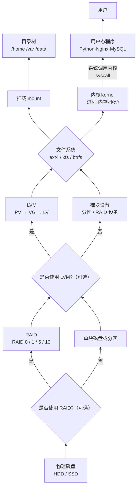

[toc]


# LVM逻辑卷

前言：

---> $之前用$ `gdisk`  $和$ `parted` $来分区，分区大小不合适，不能扩容和缩容。$

$传统的磁盘分区方案（如 $`fdisk` $或$`parted`$创建的固定分区）存在灵活性不足的问题：一旦分区大小确定，调整起来非常困难，且无法跨现实世界的磁盘去合并空间。$

逻辑卷管理器(LVM)应运而生。


Logical Volume Manager (LVM)

* PV (physical volume,物理卷。底层硬件)

* VG(volume group,卷组。屏蔽底层设备差异)

* LV(logical volume ,逻辑卷)

	

	* PV是最小存储单元，多个PE组成VG，LV操作VG即可完成部署


​		


## 部署逻辑卷


### 初始化PV

PV是LVM的基础，需要先将物理设备初始化为PV

`pvcreate` + `设备路径` 

```bash
pvcreate  /dev/nvme0n2   /dev/nvme0n3
```


而VG是PV的集合，用于统一管理存储空间

### 创建VG

```bash
vgcreate  vg_new_name  /dev/nvme0n2  /dev/nvme0n3 
```


### 创建LV

创建LV，从VG中分配空间创建逻辑卷

​	`-L` + `总容量` 

​	`-l` + `创建的数量`（创建空间 = 单位大小 * 数量 ）

​	`-n` + `lv卷名字`

```bash
lvcreate  -l 数量  -n lv_name  vg_new_name
……
lvdisplay
```


### 格式化并挂载

与传统分区一样，需要格式化文件系统并[挂载]( '也可以永久挂载')后才能使用

```bash
mkfs.ext4   /dev/vg_new_name/lv_name  
……
mkdir /mnt/vo
mount   /dev/vg_new_name/lv_name   /mnt/vo
```


## 扩容逻辑卷


*  `lvextend` 命令


### 先取消挂载

```bash
umount  /mnt/vo
```


### 扩容

```bash
lvextend -L 6G   /dev/vg_new_name/lv_name
```


### 检查磁盘完整性

[`e2fsck`]( 'e2fsck 是“Second Extended Filesystem Check”的缩写，它是用于检查和修复基于 ext2、ext3、ext4 等文件系统的工具')

[`resize2fs`]( '是 Linux 下用于调整 **ext2/ext3/ext4** 文件系统大小的工具，可在不丢失数据的情况下进行扩容或缩容，常与 **LVM** 或分区工具配合使用')

```bash
e2fsck -f  /dev/vg_new_name/lv_name
……
resize2fs /dev/storage/vo
```


### 重新挂载

重新挂载上去

```bash
mount /dev/vg_new_name/lv_name  /mnt/vo
……
systemctl daemon-reload
mount -a
df -h
```


---

> 建议：**命名规范**：VG/LV 使用有意义的名称（如 `data_vg`、`app_lv`），避免默认名称（`vg0`、`lv0`）。


# 学习脉络与体系


---





---

## 1. 磁盘

* 只会读写🤓


## 2. 分区

* 划分边界，避免相互影响


## 3. RAID

* 提供物理世界的性能和安全


## 4. LVM

* 解决“怎么利用空间”的问题，可以动态扩容和空间拼接


## 5. 文件系统

* 决定数据结构


## 6. 挂载

* 最后一公里，指明访问路径，告诉哪个文件夹，可以使用这块储存


缩小逻辑卷

（高风险操作）

```bash
lvreduce  -L 目标大小  /dev/vg_new_name/lv_name
moutnt  /dev/vg_new_name/lv_name    /mnt/vo
```


删除逻辑卷

取消挂载

```bash
lvremove   /dev/vg_new_name/lv_name
```

```bash
vgremove   /dev/vg_new_name/lv_name
pvremove   /dev/nvme0n3  /dev/nvme0n3
```


[逻辑卷快照](https://ncloud.eagleslab.com/Linux%E5%9F%BA%E7%A1%80/LVM%E9%80%BB%E8%BE%91%E5%8D%B7%E7%AE%A1%E7%90%86%E5%99%A8.html#%E9%80%BB%E8%BE%91%E5%8D%B7%E5%BF%AB%E7%85%A7 '')


