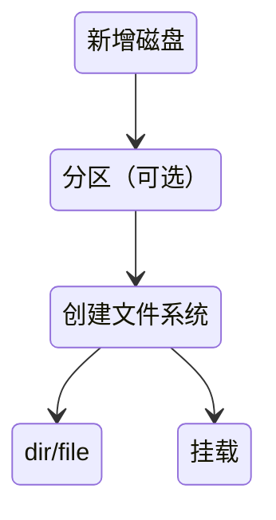

export PS1="\[\e[37;40m\][\[\e[37;41m\]\u\[\e[37;41m\]@\h\[\e[37;40m\] \W\[\e[0m\]]\\$ "


[toc]





# 磁盘分区管理

> 建议配合b站《王道考研·计算机租成原理》食用，了解底层硬件，有助于学习。
>
> 此部分比较杂，需要动手操作。


$设想，我们给服务器插入一块新的硬盘。就像种菜，给不同植物划分区域，才能更好管理这片土地。$

$为了能更好利用这块硬盘，我们需要给磁盘分区$

--->先在虚拟机中增加一块新硬盘

* `sd` 为物理（硬件）磁盘
* `nvme` 为虚拟磁盘


* 查看**块**设备

​	`lsblk` 

```bash
[root@Linuxtest ~]# lsblk
NAME        MAJ:MIN RM  SIZE RO TYPE MOUNTPOINTS
sr0          11:0    1  1.7G  0 rom
nvme0n1     259:0    0   20G  0 disk
├─nvme0n1p1 259:1    0    1G  0 part /boot
└─nvme0n1p2 259:2    0   19G  0 part
  ├─rl-root 253:0    0   17G  0 lvm  /
  └─rl-swap 253:1    0    2G  0 lvm  [SWAP]
 nvme0n2     259:3    0    5G  0 disk

 ……
```


## 磁盘分区命令

磁盘分区有三种命令

`fdisk` ,对应mbr分区表

`gdisk`，对应gpt分区表

`parted` ，高级（个性化）分区


`parted` 工具

| 命令                                                   | 操作             |
| ------------------------------------------------------ | ---------------- |
| `parted`   `/dev/设备名`   `print`                     | ==查看分区结果== |
| `parted`   `/dev/设备名`   `mklabel` +`gpt` 或 `msdos` | 创建分区表       |
| `parted`   `/dev/设备名`   `mkpart`                    | 创建分区         |
| `parted`   `/dev/设备名`   `rm`  `1`                   | 删除分区         |


`fdisk` 工具

```bash
fdisk /dev/nvme0n
……
Command (m for help): n
……
Select (default p): p
……
+/-sectors or +/-size{K,M,G,T,P}: +505M
……
Command (m for help): w

```


`gdisk` 工具

使用方式同理

```bash
yum install gdisk
……
gdisk /dev/nvme0n
……
```

完成分区，查看分区


查看分区结果，可以看到  ==unknow==

这里引入  *分区表* 的概念


## 分区表

**分区表** (Partition Table)记录分区的数量、大小、位置等信息，是磁盘的“目录”

主流分区有两种

1. MBR(Master Boot Record)

* 1983年和 IBM PC 一起推出。老资历，因为推出时间较早，所以适用于老旧的BIOS


2. GPT(GUID Partition Table ，GUID分区表)

* 1999年推出。支持大量分区；可靠性高。适用所有现代计算机
* **优先使用 GPT**：避免 MBR 的 2TB 容量限制，即使小磁盘也推荐 GPT（兼容 UEFI）。

​		

在实际生产系统中，为了兼容性、可扩容、可维护，**需要给磁盘设置分区表。**


<!-- **不要过度分区**：分区过多会增加管理复杂度，非必要场景建议用 LVM 替代多分区 -->

---


# 文件系统

*想象一块机械硬盘上面的磁头*

为什么不能在磁盘分区后，直接在磁盘上”存文件“ ？

* 当然可以，但会变成：
	* 文件互相覆盖
	* 删除一个文件，其他文件小部分被删除，文件不完整，直接爆炸🤯
	* 断电直接全盘乱


所以，文件系统解决的是“**秩序问题**”，是“**如何管理数据的规则**”

* 文件系统是告诉操作系统:
	* 有哪些文件
	* 文件从磁盘哪里开始，在磁盘的哪一段
	* 谁能看，谁能改


## 文件系统有哪些？


文件系统
├─ 是否用 inode（索引式）
│   └─ ext4 / XFS / Btrfs / ZFS（几乎全用）
└─ 是否用日志（日志式）
    └─ ext3 / ext4 / XFS / Btrfs / ZFS

 **一个文件系统可以同时是：**

- 索引式
- 日志式


索引式，就像链表指针，**快速**找到文件数据

日志式，是散列存放指针（地址），更安全

| 文件系统 | 特点                     | 应用场景     |
| -------- | ------------------------ | ------------ |
| ext4     | 成熟稳定，兼容性好，全能 | 默认文件系统 |
| XFS      | 支持高性能、高并发 I/O   | 服务器，视频 |
| NTFS     |                          | Windows      |


## 创建文件系统

使用 `mkfs`  工具(make file system)来创建文件系统


```bash
mkfs.ext4 /dev/nvme0n2p1
```


---


## 挂载文件系统


`mount` 挂载

为分区创建文件系统后

* `mount` + `想挂载的分区` + `挂载目录` 
* `umount` + `分区`   撤销挂载

**永久挂载**

```bash
 mkdir /mnt/dirtest
……
vim /etc/fstab
……
```

在最后一行加上

```bash
/dev/nvme0n2p1   /mnt/dirtest  ext4   default   0   0   
UUID=XXX         /mnt/dirtest  ext4   default   0   0   
```

> **UUID 挂载更可靠**。避免磁盘顺序变动导致挂载失败

测试是否正确配置

```bash
mount -a
……
df -h
```


---


显示磁盘空间使用情况

`df -hT`      (disk free)

`du ` 	   (disk usage)


软硬链接

软连接，删掉源文件，直接不行了

硬链接，删掉源文件，还可以

---


[qouta](https://ncloud.eagleslab.com/Linux%E5%9F%BA%E7%A1%80/%E5%AD%98%E5%82%A8%E7%AE%A1%E7%90%86.html#%E7%A3%81%E7%9B%98%E5%AE%B9%E9%87%8F%E9%85%8D%E9%A2%9D '磁盘容量配额，限制用户能使用的空间')


