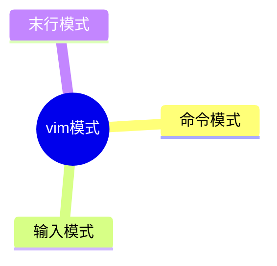
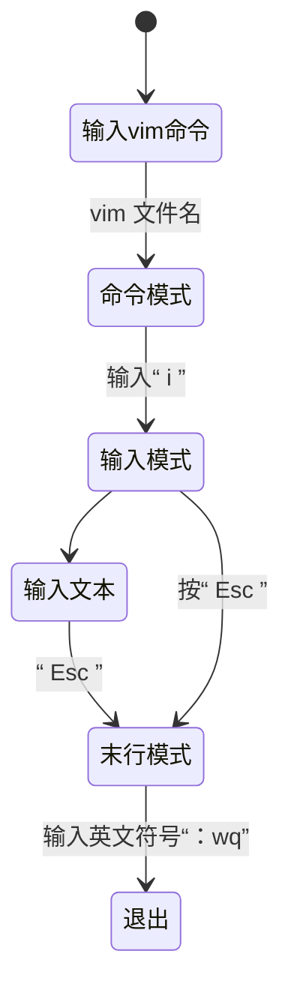
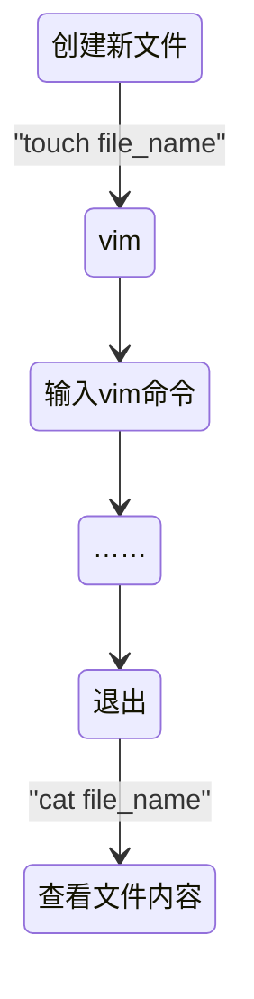

[toc]

# 文件命令（文件操作）

##  常见操作命令

| 命令 | 全称       | 操作             |
| ---- | ---------- | ---------------- |
| `ls` | list files | 列出目录及文件名 |
|`cd`|change directory|切换目录|
|`pwd`|print work directory|显示当前目录|
|`mkdir`|make directory|创建新目录[^2]|
|`rmdir`|remove directory|删除空目录|
|`cp`|copy|拷贝[^1]|
|`touch`||创建新文件|
|`rm`|remove|删除文件|
|`-f`|force|强制|
|`-r`|recursive|递归操作|
|`-p`||递归创建|

> `mkdir dir1/dir2/dir3 `   创建目录
>
> 删除就用    **`rm -rf dir1`**
>
> `cp -?? （源文件夹） （目标文件夹）`


---


## 查看文件类型

   $Linux和Windows有很大不同，Windows有文件后缀，可以显而易见看文件类型,$

   $但Linux没有文件后缀名。$


1. 有时候文件不一定是 *文本* 类型，不能用 *vim* 
2. 操作不同类型的文件，需要用到对应的工具
3. 那就得查看文件的类型，并且使用相应的工具


* **`file`**命令

	```bash
	file file_name
	```

	```bash
	[root@localhost dir1]# file file1
	
	file1: UTF-8 Unicode text
	```

	> `f`:普通文件，可执行程序
	>
	> `d`：目录（蓝色
	>
	> `l`：链接
	>
	> `s`：socket套接字
	>
	> `p`: pipe管道文件
	>
	> `b`：block块设备（硬盘，U盘）


----


## 文本文件查看


* **`cat`命令**


```bash
cat 文件名
```

*可以显示文本内容*

> `-n`可以显示行数
>
> `-b`显示非空行数


## `Vim`编辑器


- vim是一个**文本编辑器**





### **vim**操作流程

---



---


**配合`cat`  、`touch`命令即可完成一些简单操作**



---


```bash
/666word

?666word
```

> **查找**  “666word” 的字符


### 常用vim操作

​	`set nu`  在 ==末行模式== 下设置行号
​	`u` 撤销

#### 移动光标

​	 `数字` + `回车`  向下移动几行
​	 `数字` + `空格`  向右移动几列（若超出行尾，则跳到下一行）
​	 `数字` + `方向键`  向方向键移动
​	 `数字` + 连按两下`g`  移动到指定行
​	 `0` :移动到首列    `$` :移动到末尾
​	 `G` 移动到全文末尾


#### 删除文本

​	`dd`  删除光标所在行

​	`数字` + `dd`  删除光标以下的几行

​	`dgg`  删除光标以上内容

​	`dG`  删除光标以下的文本（按大写锁定即可打出大写字母）


#### 复制、粘贴


​	`yy`  复制当前行

​	`p`  粘贴到光标所在行

​	`数字` + `yy`  复制光标以下几行


#### 替换

​         ==末行模式==下


​	**`数字` `,` `数字` `s/` `查找字符/替换字符/gc` **

> 在一个区间内替换字符，并询问（confirm）是否要替换


​	**`%s/` `查找字符/替换字符/gc`**

> 在全文替换字符，并询问是否要替换


[vim使用](https://ncloud.eagleslab.com/Linux%E5%9F%BA%E7%A1%80/%E6%96%87%E4%BB%B6%E7%AE%A1%E7%90%86.html#%E4%BD%BF%E7%94%A8%E6%96%B9%E5%BC%8F  "详细请点击")


## 文件查找

*  **`find`命令**

### 1.按名称查找


```bash
find -name "file_name"
find -name "*fil*"
```

> `-name`按名称查找
>
> `-iname`忽略大小写
>
> `-name "*name*"`  模糊搜索


### 2.按时间查找

```bash
find -mtime +66
find -mtime 77
find -mtime -88
find -mmin -55
```

> `-mtime -88`  找 *88天之内*
>
> `-mtime +66`  找 *超过66天*
>
> `-mmin -55`找*在55分钟之内改动的文件*


### 3.按大小查找

```bash
find /root -size -1M
find /root -size +5M
```

> `-size -1M`找小于1M的文件（注意是大写的$M$）


### 4.按类型查找

```bash
find /root -type f
```

> `-type` `f`   按类型查找


> 这里 **`find`命令** 比较杂，详细学习留到文本三剑客、正则表达式
>
> [跳转初次学习`find`](https://ncloud.eagleslab.com/Linux%E5%9F%BA%E7%A1%80/%E6%96%87%E4%BB%B6%E5%9F%BA%E6%9C%AC%E5%B1%9E%E6%80%A7%E4%B8%8E%E6%96%87%E4%BB%B6%E6%9F%A5%E6%89%BE.html#%E6%96%87%E4%BB%B6%E6%9F%A5%E6%89%BE)


[^1]:[拷贝](https://ncloud.eagleslab.com/Linux%E5%9F%BA%E7%A1%80/%E6%96%87%E4%BB%B6%E7%AE%A1%E7%90%86.html#cp   “点击跳转”  ) 
[^2]: **`mv`** 命令可以改名字
